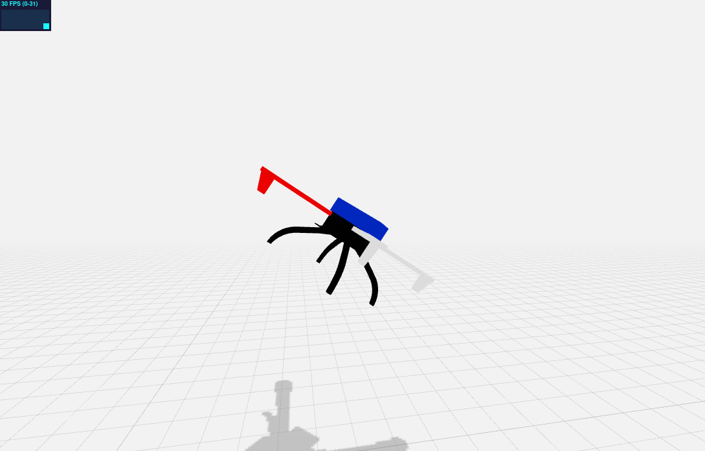

# For custom controllers 
Some information is in notes.md.
## requirements
emcc compiler.
## Changing the controller used
Change the included controller header in /src/simulator_web_interface.c.
## Writing your own
1. Make a copy of the example controller. 
2. Change the prog target to a representative const string.

The controllers outputs are, likely, written to the dutyCycle array. The following arrays are merely for inputs. 

# Testing your controller
On windows: run buildAndRun.ps1. This will automatically build your program and run a server on your localhost:8084.
# Quadcopter Flight Simulator in C and Three.js
[🌐 Run on your browser](https://pavanandrea.github.io/QuadcopterFlightSimulator/src/index.html)

This is a basic quadcopter simulator built using Three.js as a fun weekend project.
The simulator solves the nonlinear dynamics of a quadcopter, taking into account the equations of motion of the body, the dynamics of the four rotors and the battery charge.
The included controller uses a simple proportional control in ACRO mode, controlling angular rates based on linearized dynamics, without any thrust compensation.

## 🚀 Getting started

The easiest way to run the simulator is from your [web browser](https://pavanandrea.github.io/QuadcopterFlightSimulator/src/index.html)
The simulator will render a 3D quadcopter model, and you can control it using a keyboard (WASD for roll/pitch, arrows for thrust/yaw).

## 🤔 Assumptions and Limitations

As this is a weekend project, several assumptions were made to simplify the model:

- [x] No electrical transient in the brushless motors
- [x] Effect of temperature is neglected
- [x] Constant friction torque
- [x] Propeller thrust and torque approximated with fixed-point performance (J=0)
- [x] Secondary aerodynamic effects are neglected (propeller cross-flow, P-factor, propeller wakes, vortex ring, ground effect, rotation rates, influence of the frame...)
- [x] Coriolis effect is neglected

These assumptions have a strong influence on the accuracy of the simulation.
Note that this simulator is a basic implementation and may not be entirely accurate or realistic.
It is intended for experimental purposes only.

## 📑 References

[1] A. Gibiansky, "[Quadcopter dynamics, simulation and control](https://andrew.gibiansky.com/blog/physics/quadcopter-dynamics/)", Blog, 2012

[2] E. Gopalakrishnan, "[Quadcopter flight mechanics model and control algorithms](https://core.ac.uk/works/40016243/)", Master Thesis, Czech Technical University, Prague, 2016

[3] L.F.M. Mendoza et al., "[Trajectories generation for unmanned aerial vehicles based on obstacle avoidance located by a visual sensing system](https://www.mdpi.com/2227-7390/11/6/1413)", Mathematics 2023, 11(6), 1413

Other useful resources:
- Brushless motor model: https://electronics.stackexchange.com/questions/39387/how-are-current-and-voltage-related-to-torque-and-speed-of-a-brushless-motor
- Brushless motor calculator: https://www.ampflow.com/motorCalculations/
- LiPo battery voltage chart: https://blog.ampow.com/lipo-voltage-chart/
- ESC PWM control: https://www.controleng.com/understanding-the-effect-of-pwm-when-controlling-a-brushless-dc-motor/
- APC propeller data: https://www.apcprop.com/technical-information/file-downloads/
- Control system: https://wilselby.com/research/arducopter/controller-design/
- ACRO mode: https://docs.px4.io/main/en/flight_modes_mc/acro.html
- Arduino PID controller implementation: https://www.youtube.com/watch?v=4vpgjjYizVU
